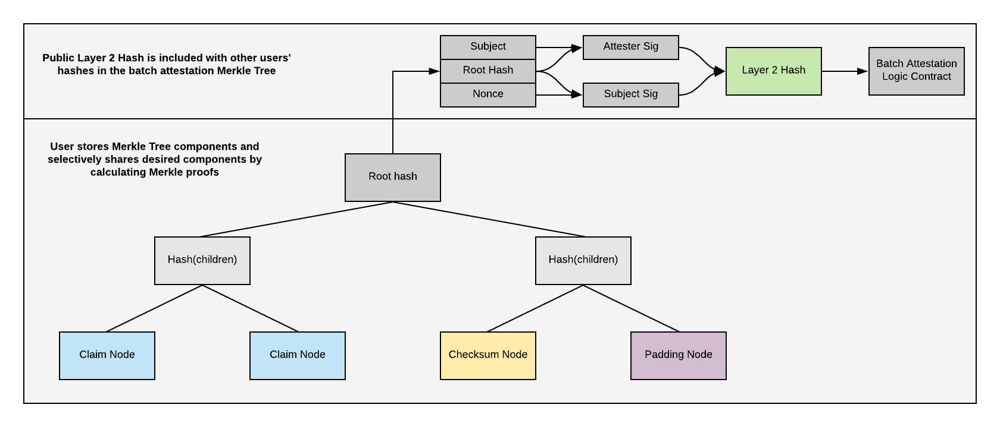
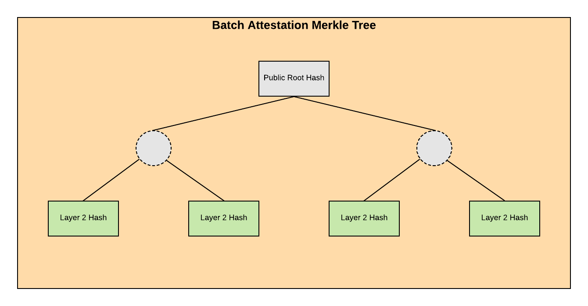
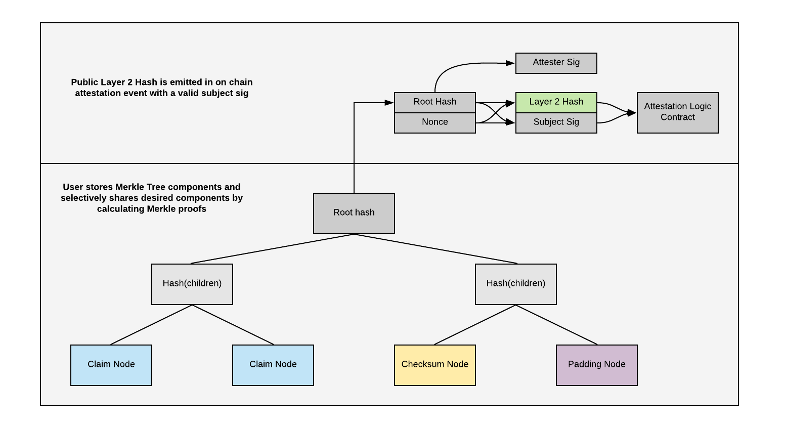
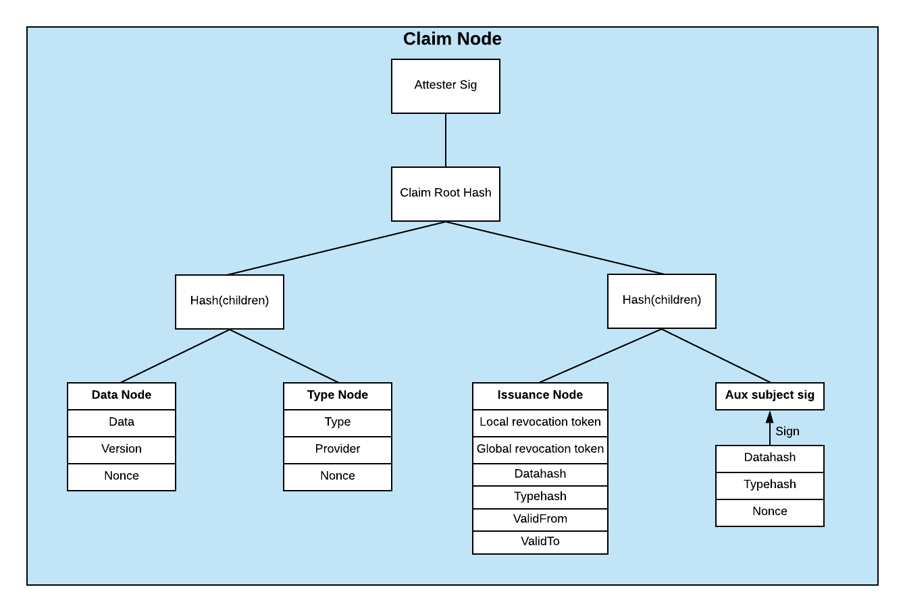

Attestation data is structured so that users have control over what data they choose to share vs conceal while giving the recipient assurance that the data they receive has been verified and has never been tampered with.

## Data Presentation

Users can share their data with a 3rd party verifier via Bloom's Share-Kit and Receive-Kit. These open source kits make it easy for developers to embed data request & validation services into their application architecture. The specification for the data presentation payload is defined in this section.

    type ResponseData = {
      /**
       * The Ethereum address of the user sharing their data
       */
      subject: string
    
      /**
       * Data shared to the receiving endpoint requested by the share-kit QR code.
       * This data can be verified by the receiver via functions in utils.ts.
       */
      data: IVerifiedData[]
    
      /**
       * Hex string representation of the `data` & `token` being keccak256 hashed
       */
      packedData: string
    
      /**
       * Signature of `packedData` by the user with their mnemonic.
       */
      signature: string
    
      /**
       * Token that should match the one provided to the share-kit QR code.
       */
      token: string
    
      /**
       * Optional proof showing the original subject has authorized the sender address to claim control and share the data.
       */
      signedAuthorization: ISignedAuthorization[] 
    }

The above `ResponseData` presentation payload contains all the data requested by the verifier in addition to the metadata needed to verify the integrity of the data. A verifier will perform the following checks:

1. Validate the format of the received data
2. Verify the data integrity by checking signatures and performing the Merkle Proof
3. Verify the on chain data integrity by comparing the entity addresses and data hashes with attestations emitted in Bloom's smart contracts

### Extensibility

The data presentation payload should allow different proofs and ownership schemas to be used in order to be interoperable with other identity and verifiable claims standards. This may be achieved by adopting a JSON-LD payload standard with `@context` fields linking to machine readable schema definitions. For now the payload is strictly defined as the above `ResponseData` type.

## Authorization

There are multiple options for a holder to prove control of a credential to a verifier. The simplest option is to sign the presentation payload along with a challenge using the same private key as the address in the on chain attestation. The original subject may also sign an authorization to allow a different private key to share their behalf. This authorization is structured similar a claim node in a Selective Disclosure Merkle Tree. This data structure allows verifiers to check the integrity of the authorization as well as check for revocation of the authorization.

Authorization works in one direction. A signed authorization object only indicates that the signer authorizes the new keypair to share data on their behalf. Not the other way around.

    interface IAuthorization {
      /**
       * Address of keypair granting authorization
       */
      subject: string
      /**
       * Address of keypair receiving authorization
       */
      recipient: string
      /**
       * Hex string to identify this authorization in the event of revocation
       */
      revocation: string
    }
    
    interface ISignedAuthorization {
      /**
       * Hash of IAuthorization
       */
      authorization: IAuthorization
      /**
       * Signed hashed authorization
       */
      signature: string
    }

## Signing

To complete an authorization the subject signs the IAuthorization object with their private key. Before signing the object is sorted alphabetically by key, then stringified and hashed using the keccak256 hashing function.

## Revocation

Revocation of authorization works the same way as attestation revocation. The revocation token embedded in the `IAuthorization` object should be emitted by an event in the `Attestation Logic` smart contract by either the subject or the recipient.

## Chaining

Authorizations can be chained together so each keypair does not have to authorize each new keypair. When checking authorization, a verifier should check each chain for revocation in the Attestation Logic smart contract. Chained authorizations are provided as an array of signed `ISignedAuthorization` objects ordered to show a relationship from the sender address back to the original subject address.

## Terms of Use

*not yet implemented*

A node in the Selective Disclosure Merkle Tree which contains terms of use a verifier is recommended to follow. The terms of use may indicate that the data is only authorized to be shared by the original subject. Or may limit chained authorizations. The terms of use may also specify a retention period of the data by the verifier.

## Selective Disclosure Merkle Tree

The tree consists of three different types of leaves: claim nodes, padding nodes and a checksum node. All nodes are sorted alphabetically by the hex string representation of the hash before constructing the tree.

The root of the tree is signed by the attester. The signature is hashed with a nonce. The resulting hash is emitted in the attestation event. The existence of the 2nd layer hash allows a user to share a Merkle proof of their verified data without revealing their BloomId. They do this by concealing the 2nd layer nonce which is hashed with the attester sig.

Attestation data is structured the same way whether the data will be verified in the Attestation Logic contract or the Batch Attestation Logic contract. The only difference is in how the Layer 2 Hash is formed.

### Batch Attestation Logic

    const layer2Hash = hashMessage(
        orderedStringify({
          attesterSig: attesterSig,
          subjectSig: subjectSig
        })
      )

Layer 2 hashes are sorted alphabetically, combined into a batch Merkle Tree then the root of the batch Merkle tree is emitted on chain. Batch Merkle trees are published regularly (every 4 blocks).

### Attestation Logic

**Code Snippets**

[https://github.com/hellobloom/attestations-lib/blob/master/src/HashingLogic.ts](https://github.com/hellobloom/attestations-lib/blob/master/src/HashingLogic.ts)

**Proving Ownership**

A verifier (data recipient) challenges the subject to sign a verifier specified token with the same keypair associated with the subject address referenced by the attester in the original attestation. The verifier can also choose to accept an authorization signature from the original subject for another keypair to share the data on behalf of the original (see authorization spec above).

A subject can also prove the validity and ownership of a single claim node by embedding an auxiliary signature node in the claim node. That auxiliary signature is signed by a different keypair than the top level subject address. The subject can share a verified claim node and sign the payload with the auxiliary private key.

### Claim Node

The claim node contains the data and type information for an attestation. Each claim node is structured as a Merkle tree with 4 leaves.

1. Plaintext attestation data
2. Plaintext type data
    - These are separate leaves so a user may choose to reveal just the type of some verified data without revealing the data itself
3. Issuance node
    - Revocation data
        - When an attester wishes to revoke an attestation they submit a revocation event to the Attestation Logic contract containing either the globalLink of nodeLink contained in an attestation. A recipient should query the attestation logic events to check if either link is revoked while validating an attestation shared by a subject. The revocation node is **always** shared so the recipient knows if the attestation is valid.
        - The revocation node also contains the hashed data and hashed types. This is so a malicious subject can't submit an alternate data or type node in the position of the secondary subject sig node without the attester's knowledge.
    - Issuance/ expiration dates
        - The attester can also include issuance and expiration dates in the issuance node in order to specify the time period a claim should be considered valid
4. Hashed auxiliary subject sig
    - A subject may choose to embed a hashed signature in the data tree. This signature should contain the dataHash and typeHash from the other leaves within this tree. If the subject wishes to prove ownership of the attested data without revealing their BloomID they can sign a challenge using the same keypair they used for the embedded signature.
    - A nonce is contained in the signature so a recipient or attester does not learn the secondary public key unless desired by the sender

The attester signs the root hash of each claim node so a user may prove this claim node was verified without having to reveal the entire tree.

    // needs updating
    export interface IAttestationNode extends IAttestation {
    	data: IAttestationData
      type: IAttestationType
      /**
       * aux either contains a hash of IAuxSig or just a padding node hash
       */
      aux: string
      issuance: IRevocationLinks
      version: string
    }
    
    /**
     *
     * @param attestation Given the contents of an attestation node, return a
     * Merkle tree
     */
    export const getDataTree = (attestation: IAttestationNode): MerkleTree => {
      const dataHash = hashMessage(orderedStringify(attestation.data))
      const typeHash = hashMessage(orderedStringify(attestation.type))
      const linkHash = hashMessage(orderedStringify(attestation.link))
      const auxHash = hashMessage(attestation.aux)
      return getMerkleTreeFromLeaves([dataHash, typeHash, linkHash, auxHash])
    }

**Padding Node**

Each non-terminal node on the tree must have no missing children. This is so no information can be gathered about the number of revealed or hidden claim nodes in the tree unless explicitly shared by the user.

The amount of padding nodes is defined as the number of terminal nodes at the given tree depth - the number of claim nodes - 1. The depth of the tree starts at 5 and increases by 5 when all the terminal nodes are filled.

Therefore, when the number of claim nodes is 15 or fewer, the height of the tree is 5. If there are greater than 15 claim nodes, the height of the tree grows to 10 which allows for 511 terminal nodes containing data plus the checksum node.

    /**
     * Given the number of claim nodes return an array of padding nodes
     * @param {number} dataCount - number of claim nodes in tree
     *
     * A Bloom Merkle tree will contain at minimum one claim node and one checksum node
     * In order to obscure the amount of data in the tree, the number of nodes are padded to
     * a set threshold
     *
     * The Depth of the tree increments in steps of 5
     * The number of terminal nodes in a filled binary tree is 2 ^ (n - 1) where n is the depth
     *
     * dataCount 1 -> 15: paddingCount: 14 -> 0 (remeber + 1 for checksum node)
     * dataCount 16 -> 511: paddingCount 495 -> 0
     * dataCount 512 -> ...: paddingCount 15871 -> ...
     * ...
     */
    export const getPadding = (dataCount: number): string[] => {
      if (dataCount < 1) return []
      let i = 5
      while (dataCount + 1 > 2 ** (i - 1)) {
        i += 5
      }
      const paddingCount = 2 ** (i - 1) - (dataCount + 1)
      return Array.apply(null, Array(paddingCount)).map(
        (item: number, index: number) => {
          return hashMessage(crypto.randomBytes(20))
        }
      )
    }

**Checksum node**

The padding nodes obfuscate the number of filled nodes. If a user wants to prove they have revealed all the data contained in an attestation they can reveal the checksum node. The checksum node contains a hash of the array of all the claim node hashes.

The checksum node is optional so the user has deniability about what data they did not reveal, if they don't want to reveal all data in an attestation tree.

    /**
     * Given an array of root hashes, sort and hash them into a checksum buffer
     * @param {string[]} dataHashes - array of dataHashes as hex strings
     */
    export const getChecksum = (dataHashes: string[]): Buffer => {
      return ethUtil.toBuffer(hashMessage(JSON.stringify(dataHashes.sort())))
    }
    
    /**
     * Given an array of root hashes, get and sign the checksum
     * @param dataHashes - array of dataHashes as hex strings
     * @param privKey - private key of signer
     */
    export const signChecksum = (dataHashes: string[], privKey: Buffer): string => {
      return signHash(getChecksum(dataHashes), privKey)
    }

## Proofs

The following diagrams show what nodes of the Merkle tree must be revealed to allow a recipient to prove the revealed data was in the attestation.

**Revealing a single node of data including a reference to an on chain attestation**

 The user must reveal the following in this proof:

- Plaintext attestation data and the nonce used to hash the data leaf
- Plaintext type data and the nonce used to hash the type leaf
- Revocation links for recipient to check against revocation events
- The attester's signature of the claim node
- The hashes of sibling nodes in the merkle tree needed to reproduce the tree's root hash
- The tree's root hash
- The attester's signature of the tree's root hash
- The nonce used to hash the attester's root hash sig

**Revealing a single node of data without revealing association with a BloomID**

- Plaintext attestation data and the nonce used to hash the data leaf
- Plaintext type data and the nonce used to hash the type leaf
- The attester's signature of the claim node
- Revocation links
- Data and type hash signed by secondary private key

**Revealing all data and proving all data was shared**

- Plaintext attestation data and the nonce used to hash the data leave
- Plaintext type data and the nonce used to hash the type leaves
- The attester's signature of each claim node
- The hashes of neighboring (sibling or parent) nodes in the merkle tree needed to reproduce the tree's root hash
- The tree's root hash
- The attester's signature of the tree's root hash
- The nonce used to hash the attester's root hash sig
- Revocation links

**Revealing a single type including a reference to an on chain attestation**

 The user must reveal the following in this proof:

- Plaintext type data and the nonce used to hash the type leaf
- The attester's signature of the claim node
- The hashes of neighboring (sibling or parent) nodes in the merkle tree needed to reproduce the tree's root hash
- The tree's root hash
- The attester's signature of the tree's root hash
- The nonce used to hash the attester's root hash sig
- Revocation links

**Revealing a single type without revealing association with a BloomID**

- Plaintext attestation data and the nonce used to hash the data leaf
- Plaintext type data and the nonce used to hash the type leaf
- The attester's signature of the claim node

**Revealing all data and proving all data was shared without revealing association with a BloomID**

- Plaintext attestation data and the nonce used to hash the data leaves
- Plaintext type data and the nonce used to hash the type leaves
- The attester's signature of each claim node
- The hashes of neighboring (sibling or parent) nodes in the merkle tree needed to reproduce the tree's root hash
- The tree's root hash
- The attester's signature of the tree's root hash

